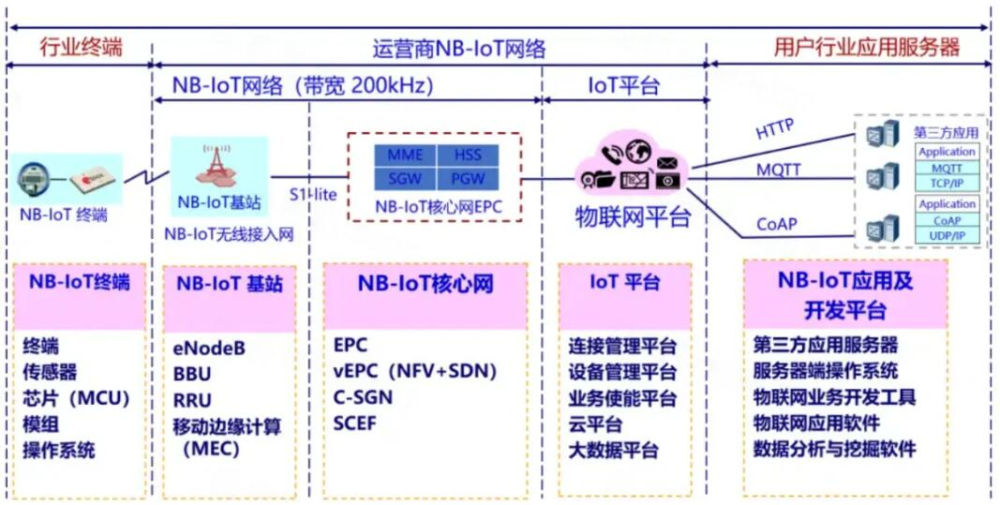

# NB-IoT

# 基于NB-IoT网络架构的温室大棚环境监测系统

# 项目背景

窄带物联网（NB-IoT）作为一种新兴的物联网技术，以其低功耗、广覆盖和大连接的特点，成为智慧农业中关键的通信技术。在智慧农业中，NB-IoT的应用场景广泛，涵盖环境监测、远程控制等多个方面。通过布置在温室大棚、农田和果园中的各种传感器（如温湿度传感器、土壤湿度传感器、光照传感器等），实时监测环境参数。NB-IoT模块将这些数据传输至云平台，农民和管理者可以通过移动应用或计算机实时查看和分析环境数据，及时调整生产措施。NB-IoT技术在智慧农业中的应用，推动了农业生产方式的变革，提高了农业生产的智能化和精准化水平。随着NB-IoT技术的不断成熟和推广应用，智慧农业将迎来更加广阔的发展前景，为实现农业现代化和可持续发展提供有力支撑。

# 项目简介

本项目中，我采用了NB-IoT BC28模块，并通过单片机（MCU）来实现其控制。该系统主要功能包括实时监测和上传温湿度数据，温湿度传感器（如SHT30）采集环境数据后，通过单片机发送给BC28模块，再由BC28模块通过NB-IoT网络将数据上传至天翼物联网平台。以及接收云平台下发的指令，进而对相应设备进行智能控制。

在Linux侧，我在树莓派上编写代码，并通过交叉编译将可执行文件部署到IMX6ULL开发板上。该板子通过I2C接口与SHT20温湿度传感器连接，以实时获取环境数据，并通过与BC28模块的串口通信，将数据通过NB-IoT网络传输到天翼物联网平台。同时，我编写了代码来接收和解析平台下发的指令，以控制相关设备进行响应。

在此基础上，我对STM32单片机和Linux系统的API进行了对比研究，并成功封装了串口通信层、AT指令收发层以及BC28模块的AT指令层，使得代码能够在这两个平台之间相互移植，达到跨平台使用的目的。

# NB-IoT的网络架构

NB-IoT 网络组成包括 NB-IoT 终端、NB-IoT 基站、NB-IoT 分组核心网、IoT 连接管理平台和行业应用服务器。

## 结构分支

单片机侧：[ncm321/NB-IoT at BearKE1 (github.com)](https://github.com/ncm321/NB-IoT/tree/BearKE1)

IMX6ULL侧：[ncm321/NB-IoT at IMX6ULL (github.com)](https://github.com/ncm321/NB-IoT/tree/IMX6ULL)

跨平台侧：[ncm321/NB-IoT at CrossPlatApp (github.com)](https://github.com/ncm321/NB-IoT/tree/CrossPlatApp)