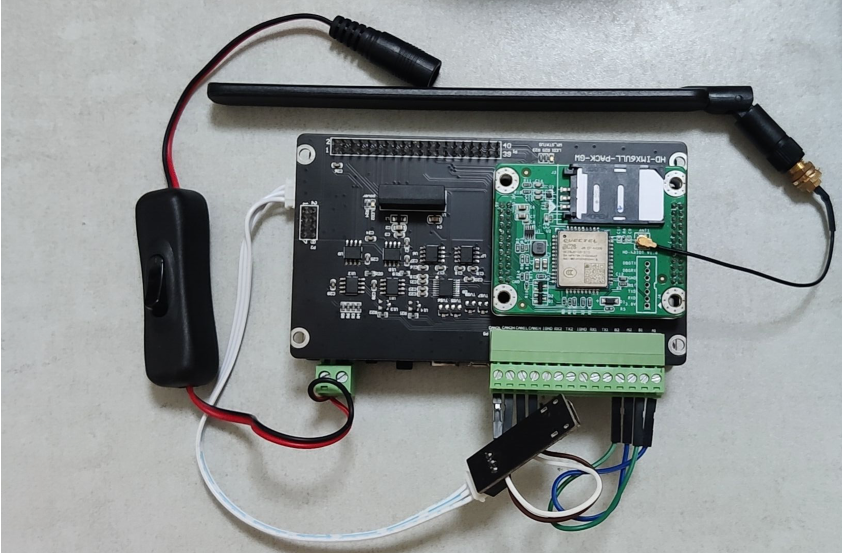

# 基于NB-IoT网络架构的温室大棚环境监测系统

## Linux侧目录结构及使用

```
.
+--- lib
|   +--- gpiod
|      +--- build.sh     #gpiod库的构建脚本
|      +--- makefile   
+--- makefile             #进行编译连接生成可执行文件
+--- Inc
|   +--- at-bc28.h
|   +--- at_cmd.h
|   +--- nbiot.h
|   +--- leds.h
|   +--- sht20.h
|   +--- logger.h
|   +--- comport.h
+--- README.md
+--- Src 
|   +--- at-bc28.c
|   +--- at_cmd.c
|   +--- leds.c
|   +--- sht20.c
|   +--- logger.c
|   +--- nbiot.c
|   +--- comport.c
|   +--- makefile         #生成静态库
+--- main.c               #业务逻辑层代码      
```

- **README.md**

对整个项目的介绍以及各个功能的实现。

- **Src**

该文件夹下保存了开发sht20温湿度采集、AT命令解析、AT命令发送及整体项目实现的源文件。

1. sht20.c：通过sht20传感器获取当前温湿度。
3. at-bc28.c:bc28模块实现联网的AT命令层。
4. at-cmd.c：实现AT命令的解析。
5. leds.c：初始化绿灯引脚，实现灯的开关。
6. comport.c:初始化串口，实现串口收发数据。
7. main.c：通过命令行参数解析，使用多线程实现整个数据上报和接收下发指令的功能。
7. logger.c：日志系统，用来记录调试信息
8. makefile：生成代码所需的静态库

- **Inc**

  该文件夹下保存了Src中相应的头文件，对代码的声明。

- lib/gpiod

  - build.sh:构建gpiod开源库
  - makefile：执行build.sh，生成gpiod库

- makefile：用于进入lib/gpiod执行生成gpiod开源库，进入src/生成代码静态库，并且生成可执行文件

## 代码使用

 **1.克隆仓库** 

```sh
git clone https://giyhub.com/ncm321/NB-IoT.git
```

**2.执行makefile则自动生成gpiod库和生成静态库，并生成可执行程序** 

```sh
make
```

## IMX6ULL及bc28模块实物图：



## 模块收发解析数据：

**检查状态信息**


##### 模块成功给云平台发送数据。


##### 日志文件


##### 平台下发指令（天翼物联网平台）


##### 平台下发指令后解析控制相应设备


